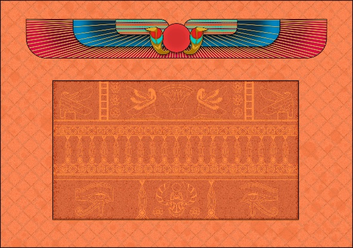
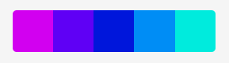

ERA’S CHAOS

Versión 1.0

Documento de diseño por Sabelton Studios

Contenido

[1.	Cambios	3](#_Toc56617791)

[2.	Concepto	3](#_Toc56617792)

[3.	Visión general del juego	3](#_Toc56617793)

[4.	Mecánica del juego	4](#_Toc56617794)

[5.	Estados del juego	4](#_Toc56617795)

[6.	Niveles	4](#_Toc56617796)

>   [6.1. Prehistoria	4](#_Toc56617797)

>   [6.2. Antiguo Egipto	5](#_Toc56617798)

>   [6.3. Edad Media	5](#_Toc56617799)

>   [6.4. Revolución Industrial	5](#_Toc56617800)

>   [6.5. Edad Contemporánea	5](#_Toc56617801)

>   [6.6. Multijugador	6](#_Toc56617802)

[7.	Progreso del juego	6](#_Toc56617803)

[8.	Arte	12](#_Toc56617804)

>   [8.1. Música y sonido	12](#_Toc56617805)

>   [8.2. Imágenes de concepto	13](#_Toc56617806)

>   [8.3. Escenarios y objetos	13](#_Toc56617807)

>   [8.3.1. Prehistoria	13](#_Toc56617808)

>   [8.3.2. Antiguo Egipto	15](#_Toc56617809)

>   [8.3.3. Edad Media	16](#_Toc56617810)

>   [8.3.4. Revolución Industrial	18](#_Toc56617811)

>   [8.3.5. Actualidad	19](#_Toc56617812)

[9.	Interfaces	21](#_Toc56617813)

>   [9.1. Menús básicos	21](#_Toc56617814)

>   [9.2. Diagrama de flujo	28](#_Toc56617815)

[10.	Modelo de negocio	28](#_Toc56617816)

[11.	Detalles de producción	29](#_Toc56617817)

>   [11.1. Planificación	29](#_Toc56617818)

>   [11.2. Costes	29](#_Toc56617819)

1.  **Cambios**

    Versión 1.0: Añadido todo lo relativo al sistema de negocio, para reflejar
    la implicación del mismo dentro del videojuego.

    Versión 2.0: Añadidas mecánicas y progreso de juego digitalizado.

    Versión 3.0: Añadida explicación de los distintos niveles presentes en el
    juego.

2.  **Concepto**

    -   **Título**: Eras’ Chaos.

    -   **Estudio**: Sabelton Studio

    -   **Plataforma**: Navegador web (PC, dispositivos móviles…)

    -   **Versión**: 1.0

    -   **Género**: Boss Fight / Shooter

-   Boss Fight: Cada lucha se basa en un enfrentamiento contra un poderoso
    enemigo.

-   Shooter: La mecánica principal del combate es el disparo.

    -   **Sinopsis de Jugabilidad y contenid**o: es un videojuego donde
        controlamos a un personaje cuyo objetivo es derrotar al adversario que
        se encuentra al otro lado del mapa. Así recorriendo diferentes épocas
        históricas el jugador irá desbloqueando diferentes elementos del juego.
        Posteriormente podrán ser utilizados para derrotar a otros jugadores
        reales a través de divertidas combinaciones de personajes y armas
        sacados de su época.

    -   **Categoría**:

        -   Microbattles (minijuego de combates entre vaqueros); la principal
            diferencia es la posibilidad de poder detener al jugador, además de
            extender este modo con diferentes épocas historias y poder
            enfrentarnos a una IA, en vez de a un jugador real.

        -   Juegos de estrategia históricos: si bien la temática es similar, en
            nuestro caso se trata de una forma más divertida y con unas
            mecánicas diferentes.

    -   **Mecánica**: El personaje se mueve constantemente en vertical con la
        posibilidad de detenerlo momentáneamente para esquivar proyectiles del
        enemigo. Además, tiene la capacidad de disparar y poder eliminar al
        adversario.

    -   **Tecnología**: Lenguajes utilizados: HTML5, CSS3, JavaScript (con la
        librería de Phaser)

    -   **Software**: Photoshop, con la licencia gratuita que facilita la
        universidad para la creación de aspectos artísticos y de UI,Visual
        Studio Code para la programación del proyecto, GitHub como fondo de
        repositorio, Itchio para la publicación y alojamiento del juego,

    -   **Público**: PEGI 12, muestra violencia no realista hacia personajes
        humanos. Está dirigido a un tipo de jugador competitivo, si bien la
        simplicidad de controles facilita la participación de cualquier jugador
        poco experimentado.

1.  **Visión general del juego**

El juego nos plantea dos dinámicas, basadas en jugabilidad solitaria y
multijugador. En la primera de ellas hacemos un repaso de diferentes eras
históricas mientras vamos derrotando enemigos, con su requerida habilidad. En el
segundo, nos enfrentaremos a amigos, pudiendo hacer locas combinaciones de
armas, personajes y eras, pudiendo así enfrentar a un neandertal con un ak-47
frente a un sicario con ballesta en plena revolución industrial.

1.  **Mecánica del juego**

-   Cámara: 2D en vista isométrica

-   Periféricos: En PC: teclado y ratón. En dispositivos móviles: pantalla
    táctil.

-   Controles: En PC: teclas para disparar (Q y O), tecla para detener al
    jugador (W y P). En dispositivos móviles: un botón para disparar y otro para
    detener al jugador, duplicados a cada lado de la pantalla en caso de
    multijugador y configurado como multitouch.

-   Puntuación: Se almacena en el caso del modo historia para llevar un ranking
    acorde al número de veces que se muere y en el nivel en que se producen las
    mismas, al ser estos de dificultad creciente

-   Guardar/Cargar: Se almacena información relativa al estado del juego
    (desbloqueados,ranking,etc.) mediante el uso de WebStorage

-   Personajes: Hay presentes dos personajes por época, uno básico y uno
    heroico, haciendo un total de diez personajes, como se muestra en el
    apartado de arte

-   Enemigos: En el caso del modo historia hay presente un tipo de enemigo por
    cada era; en el caso del multijugador el enemigo es el otro jugador

-   Habilidades

-   Armas: Hay presente un arma por época, si bien en el multijugador son
    combinables.

-   Items

1.  **Estados del juego**

    Era’s Chaos 1.0.0

2.  **Niveles**

A continuación, se detallan los diferentes niveles presentes en el juego, si
bien cabe destacar que cada nivel presenta diferencias con el anterior, que
producen un aumento de la dificultad, como son las velocidades de los
personajes, la frecuencia de disparo del enemigo, el número de enemigos, el
número, tamaño y distribución de los obstáculos...

## **6.1. Prehistoria**

-   Título del nivel: Prehistoria/Prehistory

-   Encuentro: Enfrentamiento inicial del modo historia

-   Objetivos: Vencer al enemigo y evitar ser golpeado por sus balas

-   Enemigos: Neandertal

-   Items : arma (honda)

-   Personajes: Unvaar (una mujer neandertal)

-   Música y efectos de sonido: Música ambiente (tribal) y SFX de una honda al
    disparar

-   Referencias BGM y SFX: insertar la canción

## **6.2. Antiguo Egipto**

-   Título del nivel: Antiguo Egipto/ Ancient Egipt

-   Encuentro: Segundo enfrentamiento del modo historia, tras haber completado
    el nivel anterior

-   Objetivos: Vencer al enemigo y evitar ser golpeado por sus balas

-   Enemigos: Diosa egipcia de la destrucción (Sekhmet)

-   Items : arma (hacha arrojadiza)

-   Personajes: Nahib (un hombre egipcio)

-   Música y efectos de sonido: Música ambiente (arábe) y SFX de una hacha al
    disparar

-   Referencias BGM y SFX: insertar la canción

## **6.3. Edad Media**

-   Título del nivel: Edad Media/ Middle Age

-   Encuentro: Tercer enfrentamiento del modo historia, tras haber completado el
    nivel anterior

-   Objetivos: Vencer al enemigo y evitar ser golpeado por sus balas

-   Enemigos: un caballero de negra y puntiaguda armadura

-   Items : arma (ballesta)

-   Personajes: Lamber (un escudero del medievo)

-   Música y efectos de sonido: Música ambiente (medieval) y SFX de una ballesta
    al disparar

-   Referencias BGM y SFX: insertar la canción

## **6.4. Revolución Industrial**

-   Título del nivel : Revolución Industrial/ Industrial Revolution

-   Encuentro : Cuarto enfrentamiento del modo historia, tras haber completado
    el nivel anterior

-   Objetivos : Vencer al enemigo y evitar ser golpeado por sus balas

-   Enemigos : Pudiente y explotador jefe de la fábrica

-   Items : arma (mosquetón)

-   Personajes: Thomas (un obrero de clase baja)

-   Música y efectos de sonido: Música ambiente (fábrica) y SFX de un mosquete
    al disparar

-   Referencias BGM y SFX: insertar la canción

## **6.5. Edad Contemporánea**

-   Título del nivel: Edad Contemporánea/ Current Days

-   Encuentro: Quinto y último enfrentamiento del modo historia, tras haber
    completado el nivel anterior

-   Objetivos: Vencer al enemigo y evitar ser golpeado por sus balas

-   Enemigos: un neonazi armado con un fusil

-   Items : arma (rifle de asalto ak-47)

-   Personajes: Eveline (una mujer armada) y SFX de un fusil al disparar

-   Música y efectos de sonido: Música ambiente ()

-   Referencias BGM y SFX: insertar la canción

    Además de los niveles del modo historia, está presente el nivel de
    multijugador, en que los jugadores seleccionan tanto el mapa como los
    personajes y sus armas, siempre y cuando las hayan desbloqueado en el modo
    historia o en la tienda del juego.

## **6.6. Multijugador**

-   Título del nivel: 2 jugadores/ 2 Players

-   Encuentro: Enfrentamiento entre dos jugadores seleccionado desde el menú
    principal

-   Objetivos: Vencer al enemigo y evitar ser golpeado por sus balas

-   Enemigos: El otro jugador al cual te enfrentes, con la apariencia que haya
    seleccionado

-   Items: armas, seleccionadas de forma previa a la partida, entre las
    disponibles/desbloqueadas

-   Personajes: además de los ya existentes en el modo historia, hay presentes
    personajes heroicos, cuyo uso requiere de su compra en tienda, y que son:
    Gaard (héroe prehistórico), Cleopatra (heroína egipcia), Sir Rodrick (héroe
    medieval), \*\*\*\* (héroe industrial) y Pili (heroína contemporáneo)

-   Música y efectos de sonido: La música ambiente relativa al mapa seleccionado

-   Referencias BGM y SFX: Las canciones están referenciadas en los niveles
    anteriores

1.  **Progreso del juego**

A continuación, se muestra todo el flujo de pantallas a lo largo del juego.
Indicar que se trata de una primera aproximación, y que su posterior
implementación puede variar.

1.  **Arte**

-   Música y sonido

-   Imágenes de concepto

-   Escenarios

## **8.1. Música y sonido**

>   Era’s Chaos tiene una banda sonora compuesta por 6 canciones (Menú principal
>   y épocas históricas). Todas las canciones son originales nuestras y todas a
>   excepción de la música del menú comparten un Leitmotiv en la melodía
>   principal con la finalidad de que todas tengan una pequeña relación. Las
>   canciones han sido creadas acorde a su respectiva era, teniendo cada una de
>   ellas un estilo diferente en función de la época que juguemos. Todas las
>   canciones han sido creadas con el Software DAW FL Studio.

>   El juego contiene X efectos de sonido, todos creados o modificados por
>   nosotros. Todos los audios han sido creados por nosotros mediante
>   grabaciones o producción y posteriormente editados en el software Audacity,
>   a excepción de uno que se ha obtenido de un canal de Youtube de efectos
>   libre de Copyright y posteriormente también ha sido modificado en Audacity a
>   nuestro gusto.

>   Créditos del efecto extraído: Classic Sounds

>   https://www.youtube.com/watch?v=D2TG6kNEkDE

## **8.2. Imágenes de concepto**

>   Para la realización de los escenarios no se ha requerido de numerosas
>   imágenes de concepto puesto que, en general, las ideas estaban bastante
>   claras desde el principio, así, se comenzaba directamente a trabajar en un
>   escenario, y si la idea se iba modificando, los cambios se aplicaban
>   directamente sobre el proyecto potencialmente final. El único escenario para
>   el cual sí que fue necesario realizar un concept fue para el Antiguo Egipto.

>   AQUÍ HABLAR SOBRE CONCEPTS DE PERSONAJES

## **8.3. Escenarios y objetos**

>   De forma general, se ha aplicado un filtro para añadir ruido a todos los
>   escenarios, de esta manera se evitaba un resultado demasiado plano e
>   irrealmente perfecto. Todos los escenarios han sido diseñados en Adobe
>   Photoshop CC 2019 con licencia otorgada por la Universidad Rey Juan Carlos.

>   Todos los entornos y los elementos del mismo están en lo que se conocería en
>   dibujo técnico como perspectiva de Hejduk o perspectiva egipcia. El punto de
>   vista es, por tanto, cenital. De esta manera se consigue tener la mejor
>   visión del estado del juego, ya que se obtiene el menor número de oclusiones
>   posible.

>   En cuanto a los objetos, se han diseñado 3 por cada era, que en el juego se
>   muestran repetidos y con diferentes tamaños, y en ocasiones, también
>   horizontalmente invertidos para crear sensación de mayor variedad.

### **8.3.1. Prehistoria**

>   Para los colores del escenario diseñado con la intención de representar la
>   prehistoria se ha escogido la siguiente paleta de separación complementaria:

>   El lugar elegido para ser el escenario de la prehistoria es una pequeña
>   pradera verde a la sombra de algún que otro árbol, cerca de la orilla de un
>   río, donde los habitantes del lugar han construido una pequeña cabaña con
>   barro y huesos de mamut.

>   Como color principal se ha escogido el verde, utilizado para el suelo, que
>   está cubierto de hierba. Para elementos como la cabaña troglodita, los
>   huesos de mamut o el río, se han utilizado los marrones y los azules. Para
>   añadir algo de textura a la escena se ha añadido en varios lugares la sombra
>   de las hojas de un árbol, haciendo el ambiente algo más atmosférico.

>   Los objetos que se han escogido como obstáculos para esta era son cráneos de
>   rumiantes, piedras y troncos, todos de tonos marrones para destacar con la
>   parte central del escenario, que es la pradera verde.

### **8.3.2. Antiguo Egipto**

>   Para los colores del escenario diseñado con la intención de representar al
>   Antiguo Egipto se ha escogido la siguiente paleta de separación
>   complementaria:

>   Como escenario para el Antiguo Egipo se ha elegido el interior de un templo
>   egipto ficticio, donde destaca una estética recargada de símbolos y colores.

>   Se ha escogido como color predominante un amarillo apagado con matices de
>   marrón imitando arena. Para los detalles y motivos de objetos y paredes se
>   han utilizado también puntualmente azules y rojos potentes, que son
>   frecuentemente encontrados en los yacimientos arqueológicos de tumbas y
>   templos egipcios. Este escenario está formado por dos capas superpuestas: el
>   fondo con las columnas, paredes y baldosas que se repiten y por otro lado le
>   rectángulo central de tono más rojizo. Esto se hizo así para que este
>   rectángulo, que contiene elementos circulares, no se escalara con valores
>   diferentes en X e Y como reacción a variaciones en el aspect ratio, ya que
>   los elementos circulares se verían afectados y llamarían la atención
>   negativamente.

>   Los objetos escogidos para esta era son un frutero de oro, una escultura de
>   tres gatos azules y una miniatura de una pirámide con escrituras en las
>   caras.

### **8.3.3. Edad Media**

>   Para los colores del escenario diseñado con la intención de representar al
>   Antiguo Egipto se ha escogido la siguiente paleta de tonos análogos:

>   La trifulca medieval tiene lugar en la plaza principal de una villa, donde
>   se alza un tablado de madera esperando a los siguientes pecadores para ser
>   ajusticiados.

>   De nuevo predomina un marrón claro amarillento para representar arena, y se
>   añade un marrón más oscuro para representar el tablado de madera. El color
>   más saturado sería el utilizado en la hierba: un verde con cierto matiz
>   marrón. El marrón es el color central de este escenario, y esto no es
>   arbitrario. Lo que más se pretendía transmitir en este escenario es una
>   sensación de nula higiene y de pestilencia, reforzada por la columna de
>   vapor verde que asciende desde las montañas de excrementos.

>   Para los colores de las viviendas en la parte superior se escogieron colores
>   muy poco saturados y poco alejados de un amarillo apagado, pero con alta
>   luminancia.

>   Como objetos de esta era aparecen un barril de madera, un saco de tela lleno
>   de fruta y una vasija vieja y mohosa. Los colores de los objetos son en
>   cierta medida, más saturados que los del escenario, de manera que pudieran
>   destacar algo más.

### **8.3.4. Revolución Industrial**

>   Para los colores del escenario diseñado con la intención de representar la
>   Revolución Industrial se ha escogido la siguiente paleta monocromática:

>   En la Revolución Industrial, el enclave donde ocurre el enfrentamiento es el
>   interior de una fábrica, en pleno auge de la revolución del movimiento
>   obrero.

>   Como se puede apreciar, la paleta es completamente marrón, desde tonos más
>   claros y anaranjados hasta matices casi negros, pero siempre marrón. Esto es
>   así debido a que se intentó seguir al máximo una estética steampunk, en la
>   cual suele predominar dicho color en menor o mayor medida. Así, los
>   materiales del escenario simulan ser cobrizos y en algunos puntos pueden
>   apreciarse manchas de óxido.

>   Los objetos de esta época son partes de la maquinaria que se fabrica en la
>   fábrica, como ruedas de un mecanismo o engranajes y también cajas de
>   herramientas de los trabajadores de la fábrica. El tono de los objetos no
>   está pensado para destacar sobre el fondo, ya que este nivel es uno avanzado
>   y esto añade dificultad.

### **8.3.5. Actualidad**

>   Para los colores del escenario diseñado con la intención de representar la
>   actualidad se ha escogido la siguiente paleta de tonos análogos:

>   El enfrentamiento de la actualidad ocurre en un cruce de calles de una
>   ciudad, en mitad de la calzada.

>   En este escenario, para simular un ambiente en el cual el cerebro
>   instintivamente se imagine un cielo azul con un sol poniéndose se ha optado
>   por que la luz del sol sea magenta y las sombras de los objetos sean
>   azuladas. El resto de partes del escenario son levemente menos saturadas,
>   más grisáceas, como la mayoría de las personas imaginarían una calle de una
>   ciudad cualquiera. Con la elección de esta paleta en vez de otra con más
>   base en la realidad, el escenario se aleja de tener una apariencia monótona,
>   ya que en tal caso predominarían los grises.

>   Los objetos de esta época, que son un cono de tráfico, una tapa de
>   alcantarilla levantada, un neumático y un objeto especial que es un taxi, sí
>   se salen de la paleta de colores, ya que no sería natural adaptar en su
>   totalidad estos objetos a la comentada paleta de colores. La manera en la
>   que se han adaptado los colores de los objetos a la paleta para que no se
>   sientan fuera de lugar es la siguiente: se han tintado de magenta por el
>   lado derecho simulando que el sol rebota sobre su superficie en esa área y
>   de igual manera se ha procedido por el lado izquierdo con un azul. De esta
>   manera los objetos reaccionan ante la luz del escenario de la misma manera
>   que los elementos integrados en el mismo, y no lucen fuera de lugar.

>   Para el taxi se han realizado dos sprites: uno del taxi subiendo y otro
>   bajando, ya que, debido a la perspectiva escogida, no sería visualmente
>   correcto utilizar el mismo sprite.

1.  **Interfaces**

## **9.1. Menús básicos**

>   A partir de las pantallas que se han creado en el apartado de progreso del
>   juego, se ha realizado un diseño más detallado de los menús. Todos ellos se
>   componen de un fondo creado a partir de la mezcla de cinco paredes
>   diferentes de cada era. Los botones tendrán un estilo de madera, mientras
>   que otros botones de objetos a comprar en la tienda, tendrán una gama de
>   colores marrones y dorados.

>   Toda la interfaz ha sido diseñada, a excepción de la fuente de letra
>   “Euphorigenic”.

-   **Menú principal**: Se compone del fondo, título del videojuego, botones
    para cambiar el idioma, mutear o volver a poner el sonido, historia,
    multijugador, puntuaciones, tienda y ranking.

    

    -   **Selección nivel historia**: Se accede desde el botón de historia del
        menú principal y muestra los mapas bloqueados y desbloqueados. Todos los
        mapas desbloqueados serán interactuables para poder acceder a jugar a
        ellos. Además, también se visualizará el tutorial del modo historia.

        

    -   **Selección multijugador**: Se accede desde el botón de multijugador del
        menú principal. En esta pantalla se muestran los mapas, los personajes y
        armas a elegir. Todos ellos con sus respectivos iconos de bloqueado o
        desbloqueado. Se pueden elegir entre los cinco mapas de las distintas
        eras, siempre y cuando este desbloqueado. Por cada jugador, se elegirá
        un personaje y arma. Los personajes podrán trasladarse mediante flechas
        para poder visualizar los demás. Para poder ver qué objetos se han
        seleccionado, se teñirán de amarillo. Cuando se pulse en algún objeto
        bloqueado, se mostrará un mensaje informando que el objeto está
        bloqueado y con un botón para acceder a la tienda a comprarlo. Una vez
        seleccionados todos los objetos, se procederá a pulsar el botón de
        “play”.

        

    -   **Tutorial multijugador**: Después de realizar la selección de objetos,
        se mostrará una pantalla con el tutorial de modo multijugador, mostrando
        los botones que hay que pulsar o teclas en su lugar. Una vez se haya
        comprendido el funcionamiento del juego, se pulsa el botón de continuar
        y empezará la partida.

        

    -   **Puntuaciones**: Se accede desde el menú principal y muestra las
        mejores 10 puntuaciones, ordenándolas por número de muertes y después
        por dificultad de mapa.

        

    -   **Tienda**: Se compone de cuatro apartados diferentes donde comprar
        distintos objetos: mapas, personajes, armas y paquetes para poder
        utilizar en modo multijugador. Además de tener un apartado donde
        recargar monedas virtuales. En todos los apartados se visualiza debajo
        del título, la totalidad de monedas virtuales que se poseen, y en la
        esquina inferior izquierda un botón de salir.

        

        -   **Tienda de Mapas**: Se muestra el título de los objetos a comprar y
            un total de cinco mapas. Estos muestran a través de un icono de un
            candado, si están bloqueados, además de mostrar las monedas
            necesarias para poder comprarlo.

            

        -   **Tienda de Personajes**: Se muestra el título de los objetos a
            comprar y un total de cinco personajes, que se pueden ir trasladando
            mediante las flechas de izquierda y derecha para poder visualizar
            los demás personajes que no aparecen en la pantalla. Estos también
            se muestran bloqueados y desbloqueados con la diferencia de un
            candado y las monedas necesarias para desbloquear. Además, los
            personajes heroicos tendrán un título y resplandor dorado para
            distinguirlos de los básicos.

            

        -   **Tienda de Armas**: Se muestra el título de los objetos a comprar y
            un total de cinco armas. Al igual que en los demás apartados,
            también se muestran si están bloqueadas por un icono de un candado.

            

        -   **Tienda de Paquetes**: Se muestra el título de los objetos a
            comprar y un total de tres paquetes en pantalla, que se pueden ir
            trasladando mediante flechas de izquierda y derecha para poder
            visualizar los demás paquetes. Cada paquete se compone de un título
            de paquete, que puede ser el básico con el nombre de la era, o puede
            ser el plus con el nombre de la era y un “+”. Los paquetes básicos
            se componen de mapa, personaje y arma, mientras que los paquetes
            plus, añaden el personaje heroico. Todos los paquetes muestran las
            monedas necesarias para desbloquearlos, además del porcentaje que se
            ahorraría comprando el paquete en vez de comprar los objetos por
            separado. A parte de las imágenes de los objetos, también se
            proporciona una descripción de lo que contiene el paquete.

            

        -   **Tienda Recargar**: Se muestra el título de Recargar, las monedas
            que se poseen en el momento, y tres cantidades de monedas a comprar,
            con la posibilidad de mover a izquierda o derecha mediante las
            flechas para poder ver otras cantidades. Cada cantidad de monedas
            está definida con un nombre: monedas, bolsa de monedas, saco de
            monedas y barril de monedas. Cada una tiene una ilustración de las
            monedas correspondiente a su título, la cantidad de monedas a
            comprar y el precio en euros.

            

    -   **Créditos**: Se accede desde el menú principal y está compuesto por el
        título, los desarrolladores con sus nombres y respectivos roles, y el
        modo de contacto a través de distintos botones que llevan a los links de
        cada red social. Las redes sociales a las que se pueden acceder son:
        Twitter, Instagram, Youtube, Itch.io, Github y Gmail.

        

    -   **Pantalla de Carga**: Antes de que empiece el juego, se muestra una
        pantalla con el texto “loading” y una animación de un reloj de arena,
        mientras se cargan todos los assets.

        

## **9.2. Diagrama de flujo**

1.  **Modelo de negocio**

    Se trata de un modelo *freemium*, en que el usuario tiene posible jugar al
    juego con unos contenidos básicos, si bien si quiere emplear determinados
    personajes, mapas y armas, deberá pagar por ello con la moneda de juego
    (recargable con dinero real) o desbloquear algunos de ellos a base de jugar.

    Además, se facilita también al usuario la compra de paquetes ahorro, en que
    en vez de comprar de forma independiente cada uno de los anteriores
    elementos, se compran todos ellos juntos por un precio menor (p.e. Pack
    Antiguo Egipto). Ello permite que el jugador pague por el pack en vez de los
    individuales, imbuido por el ahorro, comprando así elementos que en un
    principio no querría.

    También hay presentes elementos que no son desbloqueables jugando, como son
    personajes heroicos de cada era. Así, al tratarse de un juego multijugador,
    se produce un pique entre jugadores por tener los personajes más chulos o
    llamativos, por pura competencia. Además, la posibilidad de personalización
    siempre es un incentivo de compra.

    Finalmente, con la existencia de los paquetes ahorro se le permite al
    jugador progresar en el modo historia, de forma que, si se atasca en una
    era, se plantee el pagar por uno de estos paquetes (o cada uno de los
    elementos individuales) para dar la era por completada y poder avanzar
    niveles.

    Por otra línea, en lo que respecta a la productividad del juego a
    medio-largo plazo, se plantean distintas estrategias, como son:

    -   Realización de pequeños torneos en eventos dedicados a videojuegos (como
        es la Madrid Games Week), cuya asistencia requeriría del pago de una
        pequeña participación, y entre cuyos premios habría figuras de
        personajes de juego, así como el premio especial de disponer de tu
        propio personaje caracterizado como nuevo personaje heroico en la
        próxima entrega del juego.

    -   Pequeñas figuras comprables como merchandise en estos stands de eventos,
        así como oferta especial por la introducción de dinero en el juego (al
        entrar a participar en el sorteo de una figura de un personaje aleatorio
        del juego).

    -   Nuevos personajes a comprar por eventos especiales de juego, como
        Navidad, aniversarios, etc.

    -   Ofertas temporales, en épocas de gran compra (1-6 de enero, por
        ejemplo), de obtener la figura del personaje que desbloqueas en tienda
        por un pequeño extra.

    -   Nuevos paquetes de eras con el paso del tiempo, desbloqueables en
        tienda, tanto de épocas pasadas como de predicciones de épocas futuras.

2.  **Detalles de producción**

## **11.1. Planificación**

-   Fecha de inicio: 30 de septiembre de 2020

-   Fecha de terminación: 19 de noviembre de 2020

## **11.2. Costes**

-   Licencias

    -   Adobe Photoshop: 359,88€ /año

        -   FL Studio:
